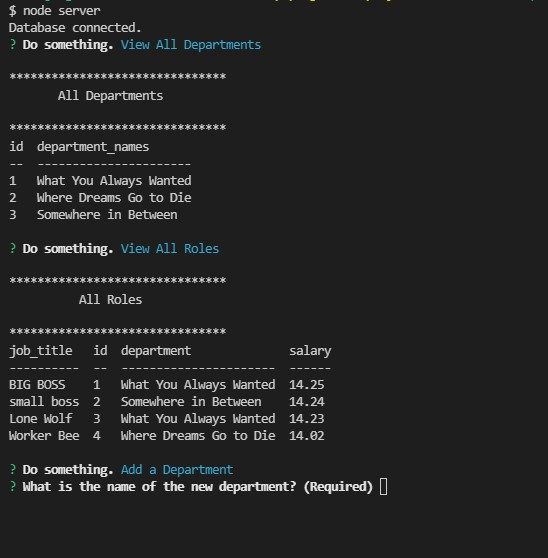

# Employee Tacker For You

## Table of Contents

- [Installation](#installation)
- [Usage](#usage)
- [Questions](#questions)

## Description

This is a program that allows someone to view all employees at their company in one convenient spot. Once in they view all departments, roles and employees. They may also add a department, role or epmployee and finally they may update the role of an employee.

## Installation

To get this running open the terminal in the root diectory and type npm init and npm install. This will install the npm packages inquire, console.tables and MySQL2 that this program uses.

## Usage

To use this program simply type node server and everthing will run. From there you will be directed to the main menu which will tell you to "Do Something" and be presented with a list of options to select from. Here is a <a href="https://drive.google.com/file/d/1hx9aRA3x9uk6VG6oqQYigxXu-UgtagEY/view">video of the Employee Tracker For You in action.</a>

## Questions

<a href="https://github.com/JohnKnee3">JohnKnee3's GitHub</a>

If you want to contact me please send me an email at john.a.clark3@gmail.com and I will get back to you as soon as possible.
